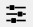

# Руководство по эксплуатации Системы навигации автономного робота

## Аннотация
Настоящий документ является руководством по эксплуатации системы навигации автономного робота и включает в себя следующие разделы:
* описание системы навигации; 
* примеры и случаи использования системы;
* руководство по установке и настройке системы навигации;
* руководство пользователя;
* технические детали.

## Введение
### Описание системы навигации
Система навигации автономного робота предназначена для создания пути перемещения робота.  

С помощью функции generate_map() система создает поле, по которому перемещается робот. В данную функцию передаются следующие параметры:
* Высота поля перемещения (height). По умолчанию, высота выбирается случайным образом в пределах от 2 до 99.
* Ширина поля перемещения (width). По умолчанию, ширина выбирается случайным образом в пределах от 2 до 99;
* Вероятность появления стены для каждой ячейки поля перемещения (wall_chance). По умолчанию, вероятность принимает значение 0.3.  

Ограничения, используемые в данной функции:
* Высота и ширина должны принимать значение, больше 1.
* Вероятность появления стены может принимать значение от 0 до 1.

Функция **generate_map()** возвращает матрицу, представляющую собой поле для перемещения. При этом каждый элемент матрицы может принимать одно из двух возможных значений:
* 0 – свободная ячейка;
* 1 – стена.

Начальная позиция робота всегда равна координатам [0;0], а координаты его цели - [height – 1; width – 1].  
С помощью функции **find_path()** вычисляется путь для робота. Если путь не найден, возвращается None. В данную функцию передаются следующие параметры:
* Матрица (robo_map), полученная из функции generate_map().
* Координаты первого участка пути (start). По умолчанию координаты равны [0;0].
* Координаты конечного участка пути (target). По умолчанию этот параметр равен последнему элементу матрицы robo_map .
* Список координат (list), принадлежащих найденному пути.

Ограничения, используемые в данной функции:
* Матрица должна иметь 2 измерения, в каждом из которых должно быть больше 1 элемента.
* Координаты первого и конечного участков пути должны принимать значения от 0 до значения последнего элемента матрицы по высоте и по ширине соответственно.

Путь вычисляется с помощью алгоритма **А***, который работает следующим образом.  
Для начала алгоритм добавляет начало пути с минимальным приоритетом очереди. Если текущий элемент является целью, то возвращается искомый путь. Затем обрабатываются соседние координаты. Берется соседняя координата и проверяется, нет ли выхода за границы карты, а также является ли рассматриваемая ячейка пустой (нет препятствия). После успешного прохождения данных проверок, рассчитывается временная стоимость пути до текущей (соседней) точки. При этом если рассматриваемая точка не была посещена или временный путь текущего элемента меньше, чем у рассматриваемой соседней точки, то переписываются координаты этой точки. После чего обновляются словари длин путей данными текущей точки. Затем в кучу добавляется рассматриваемая соседняя точка, чтобы потом ее обработать, согласно приоритету.

С помощью функции **optimize_path()** выполняется оптимизация пути робота.  Основная идея оптимизации заключается в добавлении "срезок" под углом 45 градусов, позволяя уменьшать количество поворотов робота. В данную функцию передается единственный параметр - исходный список (list) точек маршрута. Функция возвращает оптимизированный список точек маршрута.  
Ограничения, используемые в данной функции:
* Длина исходного списка точек маршрута должна быть больше 2.

Функция в цикле перебирает все точки маршрута и смотрит, есть ли диагональ. Если находит диагональ, то записывает новые точки маршрута, пропуская промежуточный элемент.  
При выводе маршрута на экран, красным цветом показывается исходный найденный маршрут, а синим – оптимизированный.  
Также выводится заголовок, найден или не найден маршрут для робота.

### Примеры и случаи использования системы навигации автономного робота
Система навигации автономного робота выполняет следующие функции: 
* создает карту с препятствиями;
* определяет исходный и оптимальный пути для робота;
* выводит на экран карту и найденные маршруты.

Примеры использования системы навигации:
1. Создание карты: 
* map = generate_map()  
Создается произвольного размера карту, с вероятностью появления препятствия 30%.
* map = generate_map(100)  
Создается карта с числом строк, равным 100 и произвольным числом столбцов. Вероятность появления препятствия 30%.
* map = generate_map(100, 100)  
Создается карта с числом строк и столбцов, равными 100. Вероятность появления препятствия 30%.
* map = generate_map(100, 100, 0.6)  
Создается карта с числом строк и столбцов, равными 100. Вероятность появления препятствия 60%.

2. Вычисление пути:
* path = find_path(map)  
Вычисление пути в переданной карте. При этом координаты первого и конечного участка пути заданы по умолчанию.
* path = find_path(map, (10, 10))  
Вычисление пути в переданной карте. При этом координаты первого участки пути равны [10,10], а координаты конечного участка заданы по умолчанию.
* path = find_path(map, (10, 10), (0, 0))  
Вычисление пути в переданной карте. При этом координаты первого участки пути равны [10,10], а координаты конечного участка равны [0,0].

## Руководство по установке и настройке системы навигации
Для установки системы навигации необходимо использовать python3. В случае, если при компилировании программа выдает ошибки, необходимо проверить, подключены ли нужные библиотеки:
* numpy (1.26.4)
* matplotlib (3.9.0)

При необходимости, подключить данные библиотеки.  
По умолчанию при запуске программы, создается карта произвольного размера (со случайно заданными параметрами). При этом вероятность появления препятствий 30%.  
Если необходимо, можно задать высоту и ширину поля, а также изменить вероятность появления препятствия, передав нужные значения в функцию **generate_map()**.

## Руководство пользователя
Для запуска системы навигации автономного робота необходимо задать координаты конечной цели пути робота и откомпилировать программу.  
Отобразится стартовая страница системы:

  

В случае, если маршрут не удалось построить, главное окно примет следующий вид:  

  

В центре экрана (Рисунок 1) отображается поле, по которому перемещается робот. Черным цветом отмечены препятствия, расположенные на поле.   
На поле отображается два маршрута для робота:
* красным цветом показан найденный исходный путь;
* синим цветом показан оптимизированный путь. Основная идея оптимизации заключается в добавлении "срезок" под углом 45 градусов, что позволяет уменьшать количество поворотов робота. 

В нижней части экрана расположены кнопки навигации по карте маршрута:

  

Кнопка  возвращает карту в исходное состояние.   
С помощью кнопки  можно перемещать карту, а также отслеживать координаты курсора мышки. При перемещении курсора в правом нижнем углу отображаются его текущие координаты на карте, а также с помощью 1 и 0 – показывается, соответственно, находится ли курсор над препятствием или над свободной ячейкой. 

   

 

Для перемещения карты в пределах поля необходимо нажать на кнопку . После чего зажать левую кнопку мыши и потянуть карту вверх, вниз, вправо или влево.

  

При изменении положения карты в пределах поля активируются следующие кнопки:
*  - отменить последнее изменение; 
*  - вернуть последнее отмененное изменение.

С помощью кнопки  можно увеличивать масштаб карты на поле. Для этого необходимо выделить участок карты, который нужно увеличить. В результате на поле отобразится только этот участок в увеличенном масштабе:  

    

Кнопка  служит для изменения настроек отображения карты. В результате нажатия на данную кнопку откроется окно настроек:
  
  

Ползунок **left** изменяет левое положение поля.  
Ползунок **bottom** изменяет нижнее положение поля.  
Ползунок **right** изменяет правое положение поля.  
Ползунок **top** изменяет верхнее положение поля.  
Кнопка  возвращает настройки в исходное положение.

     

Кнопка  предназначена для сохранения изображения - маршрута робота. При нажатии на данную кнопку откроется окно, в котором необходимо выбрать каталог, в котором будет сохранен маршрут, а также присвоить имя сохраняемому файлу.
 
## Технические детали
В системе навигации используются следующие библиотеки:
* numpy (1.26.4) – библиотека для эффективной работы с матрицами любого размера.
* heapq – модуль для работы с кучами.
* matplotlib (3.9.0) – библиотека для визуализации данных. Она используется для создания любых видов графиков.
